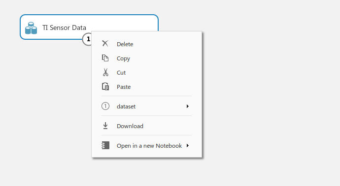
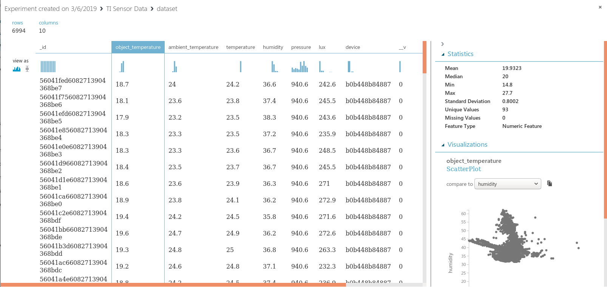
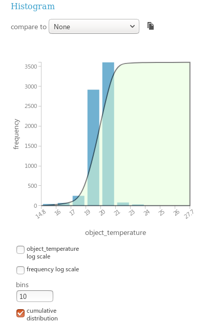
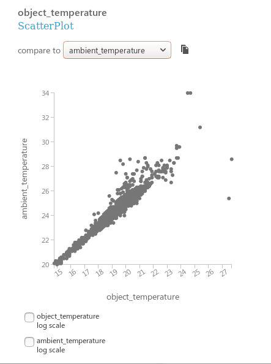

# Chapter 2: Prepare Data

# Certification objectives

## Transform data into usable datasets
- develop data structures
- design a data sampling strategy
- design the data preparation flow

## Perform Exploratory Data Analysis (EDA)

- Review visual analytics data to discover patterns and determine next steps
    identify anomalies, outliers, and other data inconsistencies
- Create descriptive statistics for a dataset

## Cleanse and transform data
 
- Resolve anomalies, outliers, and other data inconsistencies.
- Standardize data formats
- Set the granularity for data

# Prepare Data

Data does not usually come in a format ready for running a machine-learninf algorithm,
Why? because algorithms need a big data frame to work, that is, tabular data your algorithm can use.

So, the first task for us is to make data available as a bit table.

If we're lucky that information will be held in a databse, and some data will look like a table without much work.
Probably we can get that table information joining some tables we've got access to.

Azure Machine Learning Studio can process data from:
- Azure Blobs
- Azure Cosmos DB
- Azure SQL Database
- Hive Tables
- On-prem SQL Database.
- HTTP 

In Azure we can prepare data using Azure Machine Learning Studio.

Important: If you use Azure Machine Learning, you *still* can use the datasets and results you have on your **Azure Machine Learning Workspace** from a Jupyter Notebook.

Azure ML Studio provides a Jupyter notebook sample in the notebooks section.
The magic lies on this two lines of code:

```{python}
from azureml import Workspace

ws = Workspace(
    workspace_id='XXXXXXXXXXXXXXXXXXXXXXXXXXXX',
    authorization_token='YYYYYYYYYYYYYYYYYYYYYYYYYYY',
    endpoint='https://studioapi.azureml.net')

```
Both the wokspace ID and the authorization token can be found in the "⚙ Configuration" section in the Azure ML Studio sidebar.

With this workspace object, you can access all the stuff you have in your Azure Machine Learning Studio workspace:

```{pyhton}
dir(ws)
['__class__',
 '__delattr__',
 '__dict__',
 '__dir__',
 '__doc__',
 '__eq__',
 '__format__',
 '__ge__',
 '__getattribute__',
 '__gt__',
 '__hash__',
 '__init__',
 '__le__',
 '__lt__',
 '__module__',
 '__ne__',
 '__new__',
 '__reduce__',
 '__reduce_ex__',
 '__repr__',
 '__setattr__',
 '__sizeof__',
 '__str__',
 '__subclasshook__',
 '__weakref__',
 '_rest',
 'api_endpoint',
 'authorization_token',
 'datasets',
 'example_datasets',
 'example_experiments',
 'experiments',
 'management_endpoint',
 'user_datasets',
 'user_experiments',
 'workspace_id']
``` 

- develop data structures
- design a data sampling strategy
- design the data preparation flow

## Data Strategy:   Bronze, Silver, Gold areas

A common technique, inherited from the Business Intelligence world, is to use several stages and environments for procesing data.

The fist is the 'staging area', sometimes called 'raw', or 'bronze' area.
In this area we have all data ingested from the original source *without* taken into account field formats.
Usually all data is read as-is in string form, just to be sure that in case we loose the source files, all data is in our database and we cannot loose it easily just removin files.

The second area is the 'Silver' area. In this second area all fields have their correct format.
Somethimes the indexes needed are there, too.

Finally in the 'Gold' area we get both original (processed) data, and data generated by the ML models.
This is the area visualization applications and/or frontends use to read data.

# Design a Data Sampling Strategy

Why Data Sampling?

Sometimes the data you have does not fit computer memory, or is too large to be used by some algorithms that have high computational complexity.

In this case, we need to sample the data to be able to process it.

There are two types of sampling techniques:

- Probability sampling
- Non-probability sampling

The diference between those two is the use of randomization to select the data or not.
With randimized data all samples have the same probability to be chosen, and fits better the underlying
distribution of the dataset.
Non-probability sampling uses a deterministic criteria for sampling the data. For instance, getting the last 1000 samples, or last month of data.

You can use out--the-box Stratified split inside Azure ML Studio.

# Perform Exploratory Data Analysis (EDA)

Exploratory Data Analysis is the first tool you have in your belt when dealing with data.

EDA looks at the variables and their statistics (mean,average, median, etc), and also pairs of values to discover relations that can be exploited when developing models.

Typical of EDA techniques:

- R, Python: summary of the dataframe.
   This will return mean, max, minimum, median, average values, and confidence interval around the mean for every variable.

- R: ggpairs (dataframe)
   Returns scatterplots for each pair of variables in the dataset. Useful to spot relations that could wokr. Not just linear relation; but also logarithmic, etc...

- Azure Machine Learning Studio

Within Azure ML Studio you can do Exploratory Data Analysis from the browser.
Just click on the dataset you want to explore:



A new window inside Azure ML Studio will open showing you dataset characteristics.
Here you can see all details from your dataset:



- Column names
- Variable distribution (as histogram or box plot)
- Some rows from the analytical data frame.

If you click on a column, you'll also get:
- Column statistics (max, min, median, mean, stantard deviation, unique values, missing values).
- Detailed histogram or box plot (you can adjust the scale to log on all axes), including the CDF 
- Comparision between the selected variable and others 

### Types of visualization

| Visualization | Good for |
|:--------------|:---------|
| Histogram     | Great to find peaks and tails. I also like to use it to spot quickly if a distribution is multimodal. |
| Boxplot       | Use it to spot quickly outliers |
| Cummulative Function Distribution | Find median, heads and tails |

# References
[Towards Data Science: Sampling Techniques](https://towardsdatascience.com/sampling-techniques-a4e34111d808)
